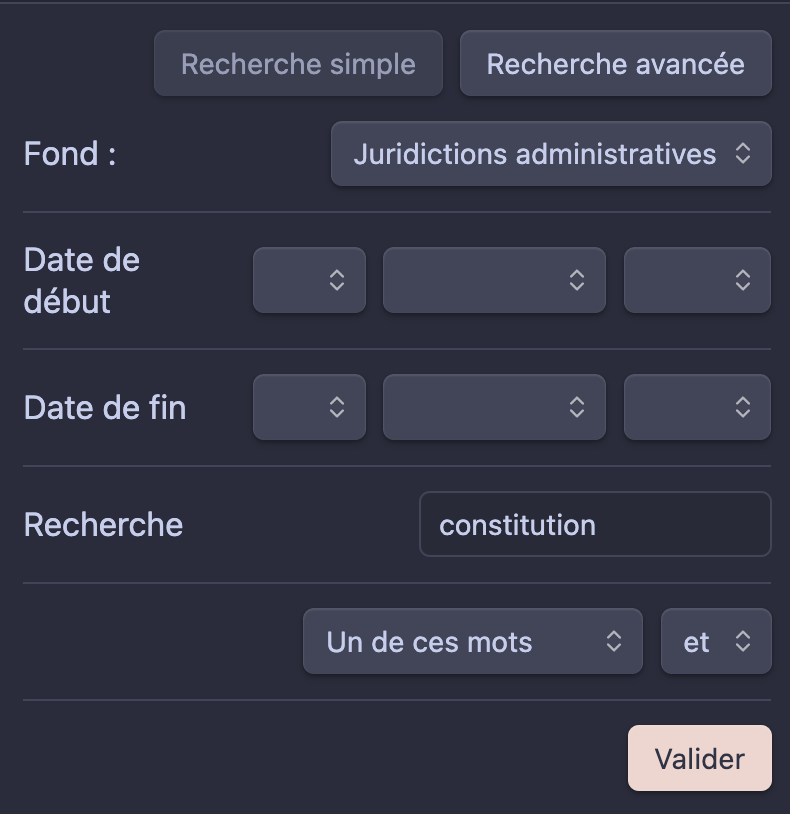
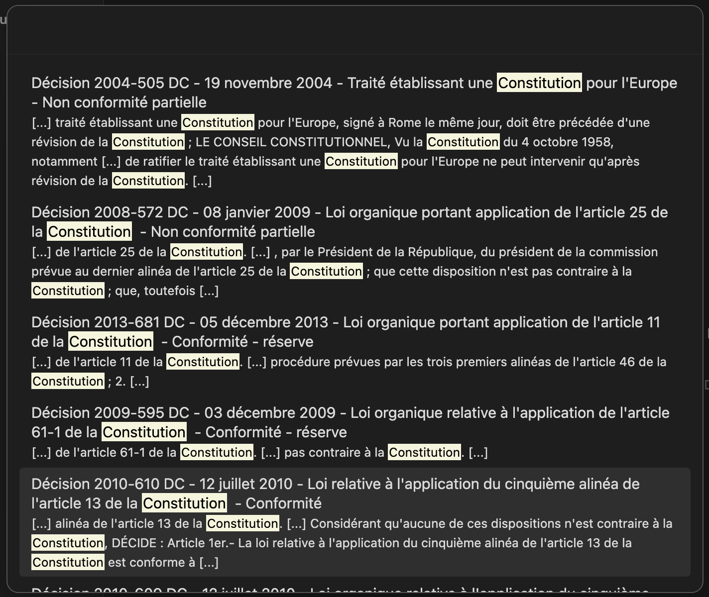
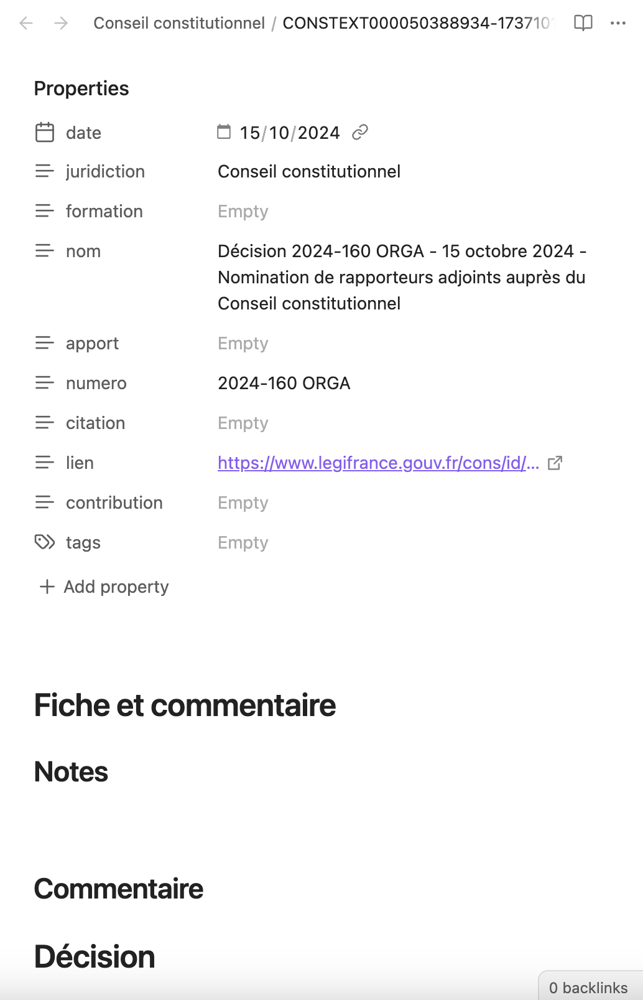
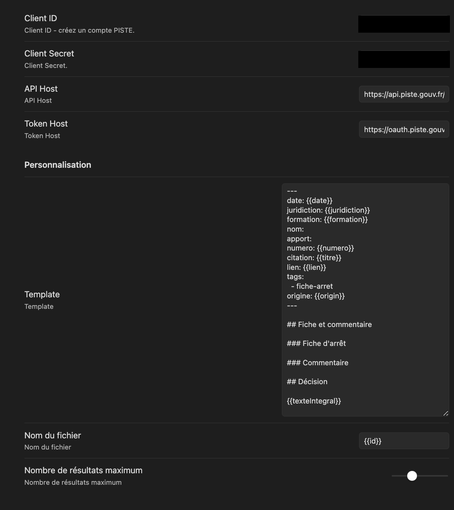

## Intégration de l'API Légifrance dans Obsidian

Ce module intègre l'API Légifrance dans l'environnement de travail [Obsidian.md](https://obsidian.md/).

Grâce à vos identifiants PISTE (obtenus gratuitement via la [plateforme en ligne](https://piste.gouv.fr/)), vous pouvez désormais utiliser Légifrance directement dans Obsidian !

Très simple d'utilisation, ce module vous permet de rechercher parmi les différents fonds de données de la plateforme afin de consulter les textes directement dans Obsidian. Vous pourrez ainsi créer une note contenant les informations principales des décisions (encore en développement pour la législation et les autres documents) directement dans votre _coffre_ Obsidian.

## Options

-   Recherche simple parmi les fonds principaux de jurisprudence (administrative, judiciaire, constitutionnelle) ;
-   Choix du texte parmi les résultats ;
-   Personnalisation du format des notes créées (via un système très simple d'étiquettes) ;
-   Personnalisation du format des titres (même système d'étiquette) ;
-   Personnalisation du nombre de résultats souhaités (50 maximum).

### Captures d'écran

_Recherche simple :_

_Affichage des résultats (mot recherché dans l'exemple : Constitution) :_

_Création de la note automatiquement :_

## Paramètres

-   Paramètres de connexion au service PISTE :
    -   Client ID (disponible après inscription au service PISTE) ;
    -   Client Secret (disponible après inscription au service PISTE);
    -   Hôte API (valeur par défaut) ;
    -   Token API (valeur par défaut).
-   Personnalisation :
    -   Modèle de note de jurisprudence ;
    -   Modèle du titre des notes de jurisprudence ;
    -   Choix de nombre de résulats affichés (5 min, 50 max).

### Les modèles

Vous pouvez personnaliser le modèle de note qui sera créée comme vous l'entendez. Pour cela, utilisez la zone de texte à cet effet dans les paramètres. Le moteur de modèle est Mustache JS. Pour afficher une valeur, il suffit de l'encadrer entre deux paires d'accolades.

ex. `{{titre}}`

Voilà les variables accessibles :

-   `{{ titre }}` - titre de l'entrée. Correspond en général à la citation de la décision
-   `{{ id }}` - l'identifiant de la décision sur la base de données de Légifrance
-   `{{ lien }}` - lien vers le site de Légifrance
-   `{{ origin }}` - Fond dans lequel se trouve la décision
-   `{{ texteIntegral }}` - Le texte intégral de la décision
-   `{{ numero }}` - Le numéro de l'affaire, de la décision
-   `{{ date }}` - Date de la décisions sous la forme YYYY-MM-DD
-   `{{ annee }}` - Année de la décision
-   `{{ juridiction }}` - Juridiction qui a rendu la décision
-   `{{ formation }}` - Formation de la juridction
-   `{{ solution }}` - Solution de la décision
-   `{{ urlCC }}` - Lien vers le site du Conseil constitutionnel pour les décisions du Conseil constitutionnel
-   `{{ #sommaires }} {{ resume }} {{ /sommaires }}` (c'est une liste qui peut contenir plusieurs entrées. La syntaxe ici permet de faire une boucle et d'afficher toutes les entrées) - Liste des sommaires.

## Comment l'utiliser

### Installer le plugin

Pour l'instant, le module n'est pas encore disponible sur l'application elle-même.

Il suffit de télécharger les trois fichiers (`main.js`, `manifest.json`, `style.css`) disponibles sur la dernière version du module ([ici](https://github.com/carnetdethese/legifrance-integration/releases)) et les déplacer dans le dossier : `/.obsidian/plugins/legifrance-integration`. Pensez à autoriser l'utilisation de module tiers dans les paramètres.

Une fois le module validé par l'équipe d'Obsidian, il sera disponible directement depuis l'application.

### Utilisation de l'API Légifrance

1. Créez un compte sur l'application PISTE : https://piste.gouv.fr/ ;
2. Dans l'onglet `Applications`, créez une nouvelle application ;
3. Entrez le nom que vous souhaitez donnez à cette connexion, renseignez les informations nécessaires. Laissez la case `Activer l'application` cochée. Cliquez sur `Sauvegarder l'application` ;
4. Cliquez sur `Cliquez ici pour accèder à la page de consentement` : c'est une étape importante pour accepter les conditions d'utilisation du service. Sélectionnez le service _Légifrance_ et acceptez les conditions d'utilisation ;
5. Retournez sur la page de l'application créée et sélectionnez l'application `Légifrance` afin d'activer l'accès à l'API. Validez ;
6. Récupérez les identifiants de connexion dans l'onglet de l'application `Authentification`. Il y a là deux types de codes - il faut sauvegarder, dans un lieu secret et accessible de vous uniquement, le `Client ID` et le `Client Secret` (il faut cliquer sur `Consulter le client secret`) de la section OAuth (deuxième volet des identifiants) ;
7. Une fois ces identifiants récupérés, vous pouvez les insérer dans les paramètres du module ! C'est tout !

## TO-DO

-   [ ] Visualisation des documents dans Obsidian dans une fenêtre, sans insertion dans une note.
-   [ ] Recherche dans tous les fonds disponibles.
-   [ ] Recherche complexe : intégration des opérateurs booléens.

## Soutien

Si vous souhaitez soutenir le projet, vous le pouvez via ce lien :

